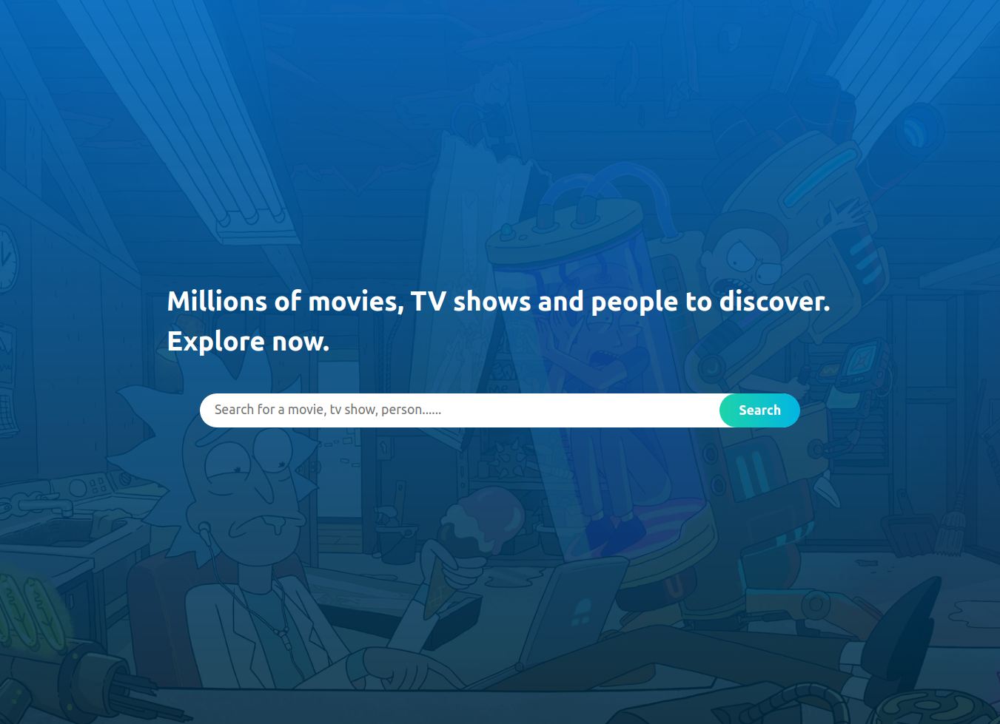
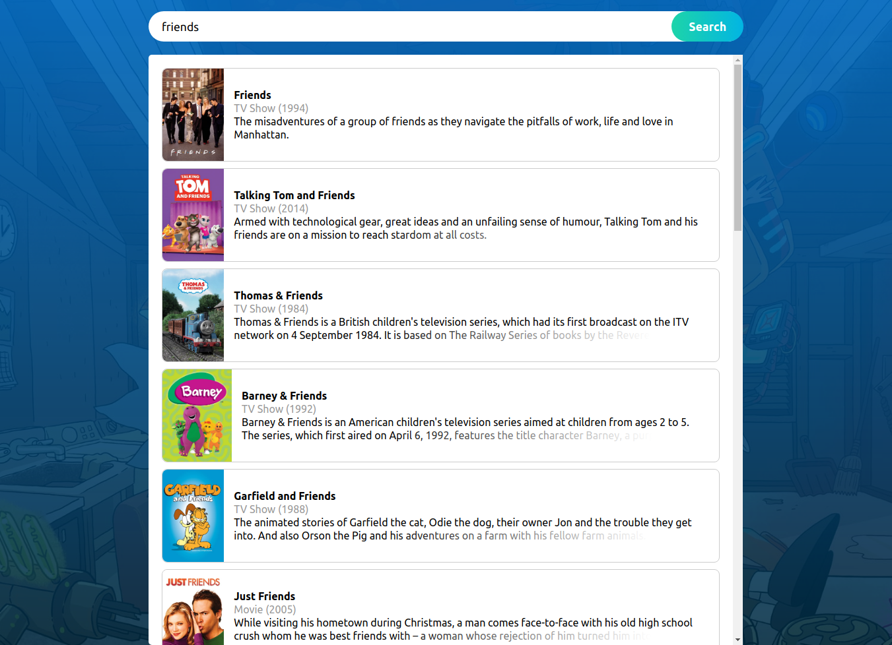
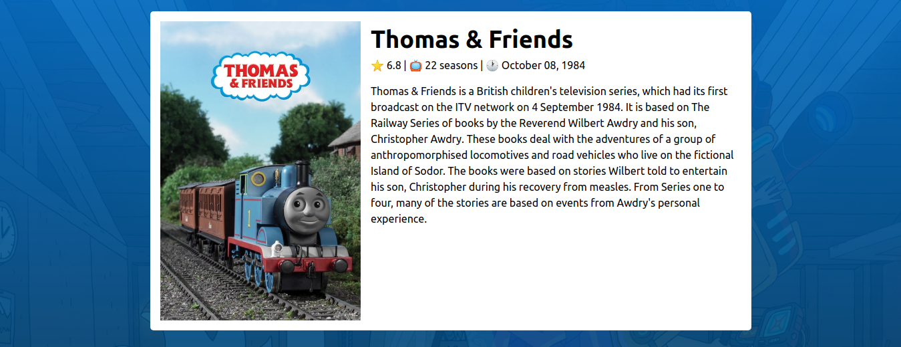

# Movie Searcher

<p align="center">
  <a href="https://github.com/yagoernandes/template-react">
    
  </a>
  <a href="https://github.com/yagoernandes">
        
    </a>
    <a href="#">
        
    </a>
    <br />
    <a href="https://twitter.com/intent/follow?screen_name=yagoernandes">
        
    </a>
  
</p>

> Search by movies and tv shows with an simple interface

<p align="center"></p>
<p align="center"></p>
<p align="center"></p>

## Sumary 

- [Description](#eyes-overview)

- [Pre requisites](#warning-pre-requisites)

- [How to run](#construction_worker-how-to-run)

- [Dependencies](#books-dependecies)

- [License](#license)

## :eyes: Overview 

<p align="justify">
  With [Movie Searcher](https://github.com/yagoernandes/movie-searcher) you can search in a catalog with millions of movies and tv shows, you can see important data about the movie and tv show.
</p>


## :warning: Pre requisites

- [Node](https://nodejs.org/en/download/)


## :construction_worker: How to run:

First, you need a valid API key of the [TheMovieDB.org](https://www.themoviedb.org/), you can create one [here](https://www.themoviedb.org/settings/api).

Clone the project from github:

```shell
git clone https://github.com/yagoernandes/movie-searcher
cd movie-searcher
```

Copy the `.env.example` file into `.env`

```shell
cp .env.example .env
```

Put the API KEY created on specific field (`REACT_APP_API_TOKEN`)

Install dependencies:

```shell
yarn
# or
npm i
```

Start the application:

```shell
yarn start
# or
npm start
```

## :books: Dependecies 

- [React](https://pt-br.reactjs.org/docs/create-a-new-react-app.html)
- [Typescript](https://www.typescriptlang.org/)
- [React Router DOM](https://reacttraining.com/react-router/web/guides/quick-start)
- [Redux Saga](https://redux-saga.js.org/)
- [Styled Components](https://styled-components.com/)
- [Axios](https://github.com/axios/axios)


## License

The [MIT License]() (MIT)


---

<p align="center">
Made with :heart: by <a href="https://www.linkedin.com/in/yagoernandes">YagoErnandes</a>
</p>